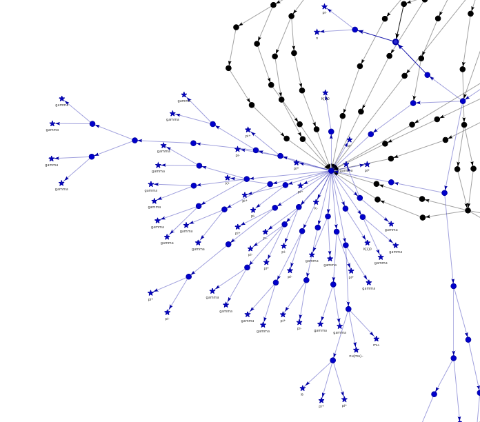
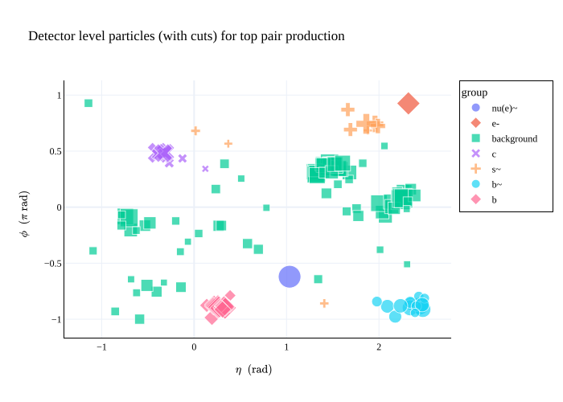
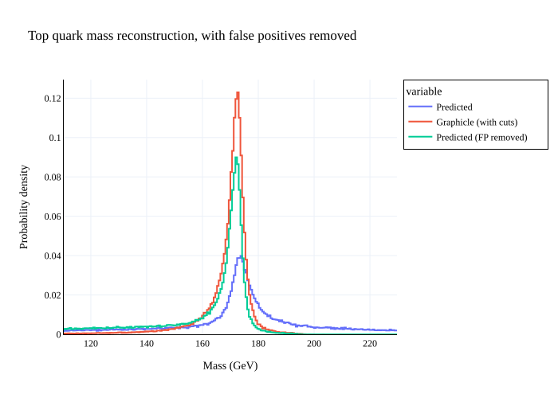

⚛️ Colliderscope
================

|DOI| |PyPI version| |Tests| |Documentation| |License| |pre-commit| |Code style:
black|

**Bring your particle physics data to life!** ✨

Colliderscope is a Python package for beautiful, interactive, and insightful visualisation of high-energy physics (HEP) data. Whether you're exploring complex event histories or slicing through pseudorapidity-azimuth space, `colliderscope` helps you understand your simulations and results visually and intuitively.

🚀 Features
--------

🔄 Interactive Event DAGs
+++++++++++++++++++++++++

- Visualise entire Monte Carlo event histories as **directed acyclic graphs (DAGs)** using `graphicle`
- **Nodes** represent **interactions**; **edges** are **particles** flowing through the event
- Final state particles are displayed as ⭐️ **star-shaped nodes** and labelled (`pi0`, `gamma`, etc.)
- Hover to explore particle flows and interaction vertices
- Use **boolean masks** to highlight specific event chains or particle types

🌐 Scatter Plots in η–ϕ Space
+++++++++++++++++++++++++++++

- Create rich interactive scatter plots of particles in **pseudorapidity (η)** vs **azimuthal angle (ϕ)** space using **Plotly**
- Group particles by **ancestor**, **status**, or custom logic using **named masks**
- Toggle group visibility in the legend, and **zoom** or **pan** effortlessly
- Apply flexible cuts on $\\eta$, $p_T$, and control whether $\\phi$ is shown in units of π
- Supports labels, titles, and metadata for use in **Dash** or other callbacks

📊 Histogram Utilities
++++++++++++++++++++++

- Build memory-efficient 1D and 2D histograms with constant space usage
- Track overflow bins and compute **normalised densities** for visualisation
- Serialise and deserialise histograms easily for I/O or logging workflows

🎨 Plot Histograms with Style
~~~~~~~~~~~~~~~~~~~~~~~~~~~~~

- Use `plotly` to render your histograms with options for:

  * **Bar** or **line** plot styles
  * Overlaid datasets or probability density functions
  * Adjustable opacity for layered plots
  * Full interactivity: **tooltips**, **zoom**, and **legend toggling**

📦 Installation
---------------

Get started in seconds via PyPI:

::

   pip install colliderscope

📚 Documentation
----------------

A full API reference is hosted in our `documentation <https://colliderscope.readthedocs.io>`__.

.. |DOI| image:: https://zenodo.org/badge/424939048.svg
  :target: https://doi.org/10.5281/zenodo.15753776
.. |PyPI version| image:: https://img.shields.io/pypi/v/colliderscope.svg
   :target: https://pypi.org/project/colliderscope/
.. |Documentation| image:: https://readthedocs.org/projects/colliderscope/badge/?version=latest
   :target: https://colliderscope.readthedocs.io
.. |License| image:: https://img.shields.io/pypi/l/colliderscope
   :target: https://raw.githubusercontent.com/jacanchaplais/colliderscope/main/LICENSE.txt
.. |pre-commit| image:: https://img.shields.io/badge/pre--commit-enabled-brightgreen?logo=pre-commit
   :target: https://github.com/pre-commit/pre-commit
.. |Code style: black| image:: https://img.shields.io/badge/code%20style-black-000000.svg
   :target: https://github.com/psf/black
.. |Tests| image:: https://github.com/jacanchaplais/colliderscope/actions/workflows/tests.yml/badge.svg
